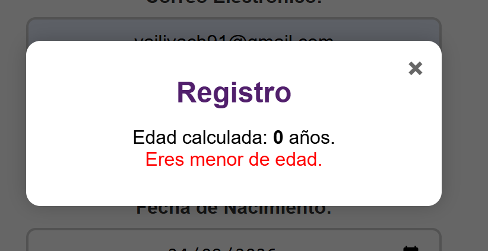
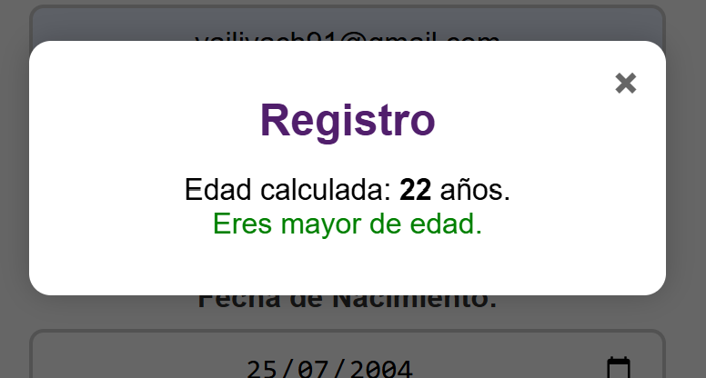
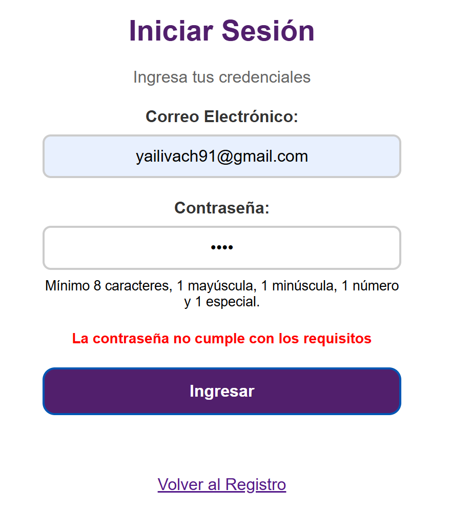
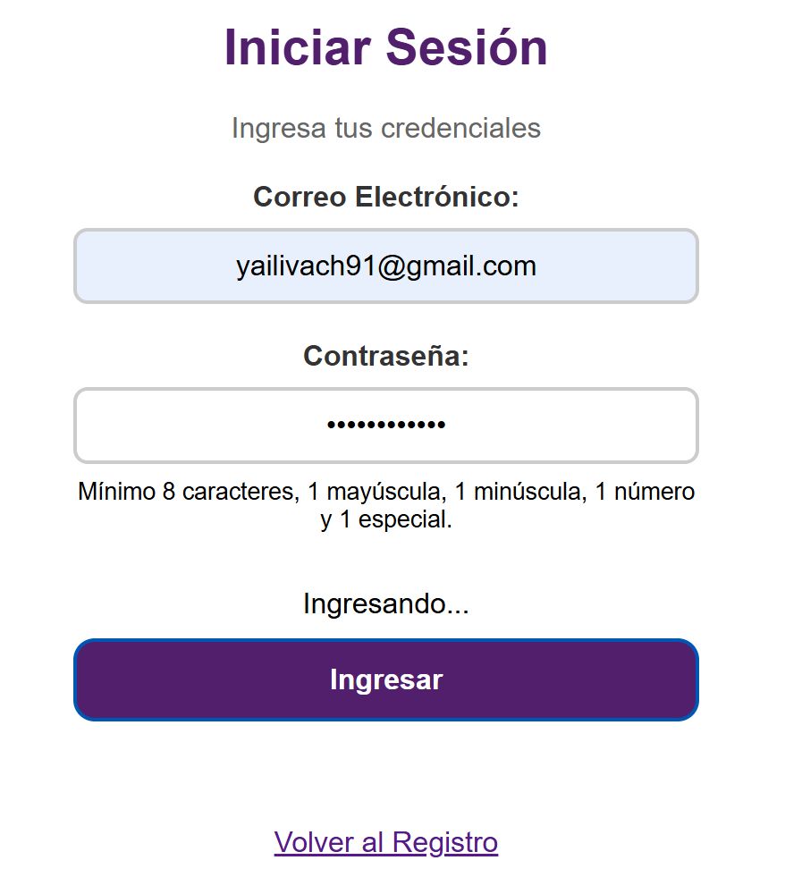

# Utilería JS

Nadya Yahuili Avendaño Chavez

## ¿Qué problema resuelve?
Esta librería permite validar datos de formularios, calcular edades, validar contraseñas y dar formato a textos y cantidades, sin utilizar frameworks.
## Instalación
```html
<script src="js/utileria.js"></script>
```
## Funciones obligatorias

* `validarCorreo(correo)`: valida el formato de un correo.
* `soloLetras(texto)`: permite letras, acentos, ñ y espacios.
* `validarLongitud(numero, maxLongitud)`: valida la longitud de un número.
* `calcularEdad(fechaNacimiento)`: calcula la edad.
* `esMayorDeEdad(fechaNacimiento)`: verifica si una persona tiene 18 años o más.
* `validarPassword(password)`: valida una contraseña segura.

## Funciones adicionales

* `formatearMoneda(cantidad)`: convierte una cantidad a pesos mexicanos.
* `limpiarEspacios(texto)`: elimina espacios innecesarios.

## Ejemplos de uso

```javascript
console.log(validarCorreo("usuario@gmail.com")); // true
console.log(soloLetras("María López")); // true
console.log(validarLongitud("9512345678", 10)); // true
console.log(calcularEdad("2004-05-10")); // Edad calculada
console.log(esMayorDeEdad("2004-05-10")); // true o false
console.log(validarPassword("Hola123!")); // true
console.log(limpiarEspacios("  Hola   mundo  ")); // Hola mundo
```

La librería se utiliza en:

* `index.html`: formulario de registro y modal con la edad calculada.
* `login.html`: validación de correo y contraseña.

## Capturas de pantalla







## Video demostrativo
https://drive.google.com/file/d/1ckijM8rHxgXzoUf7b2fUWclD_G4Bg1Du/view?usp=sharing